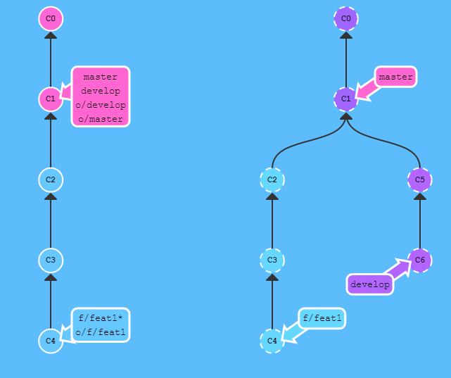
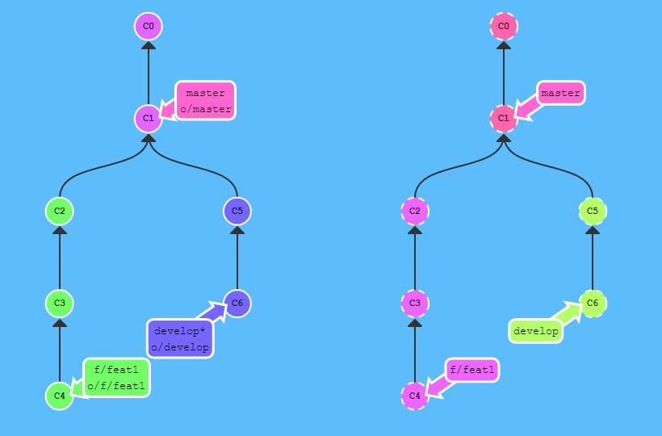
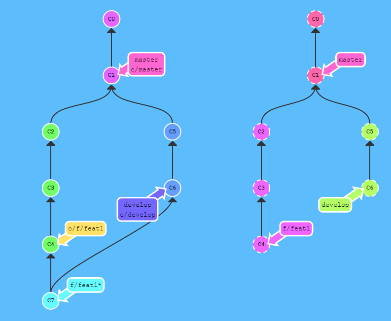
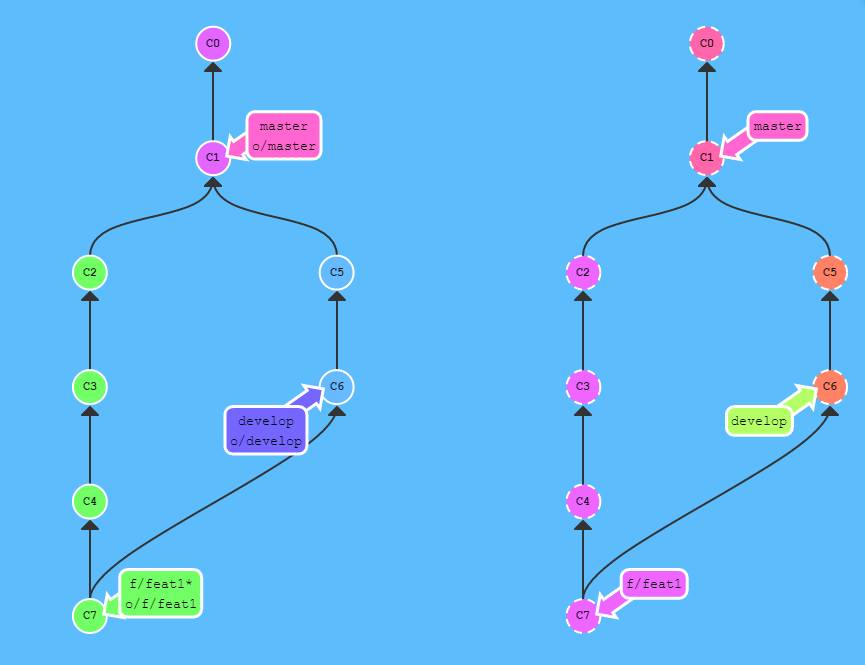
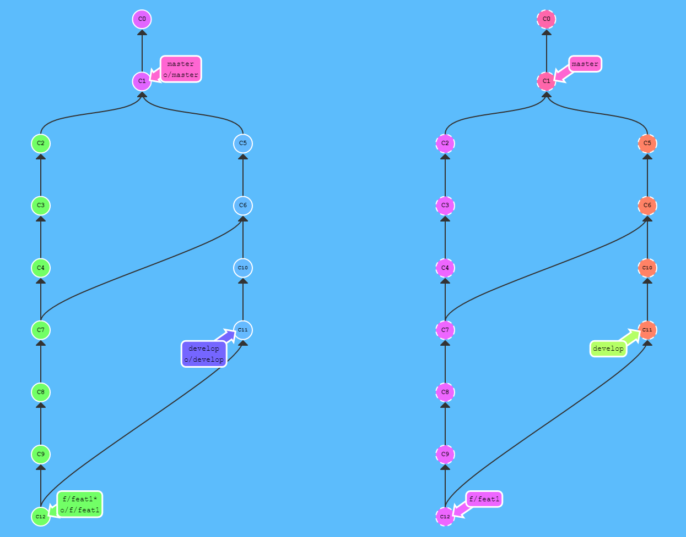
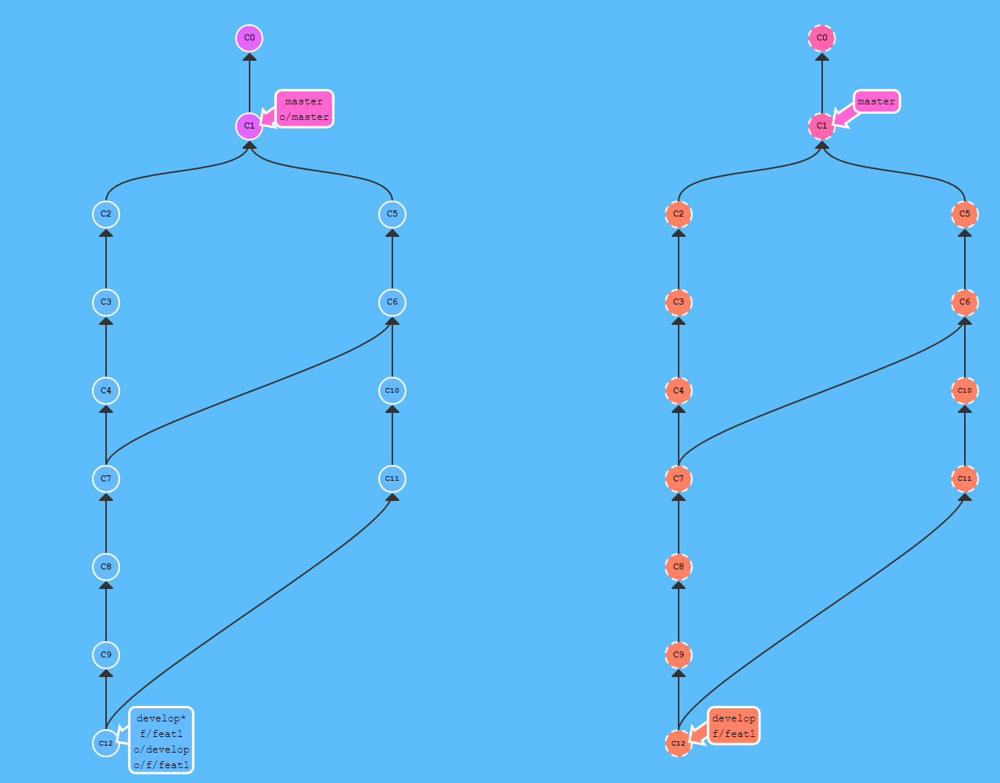
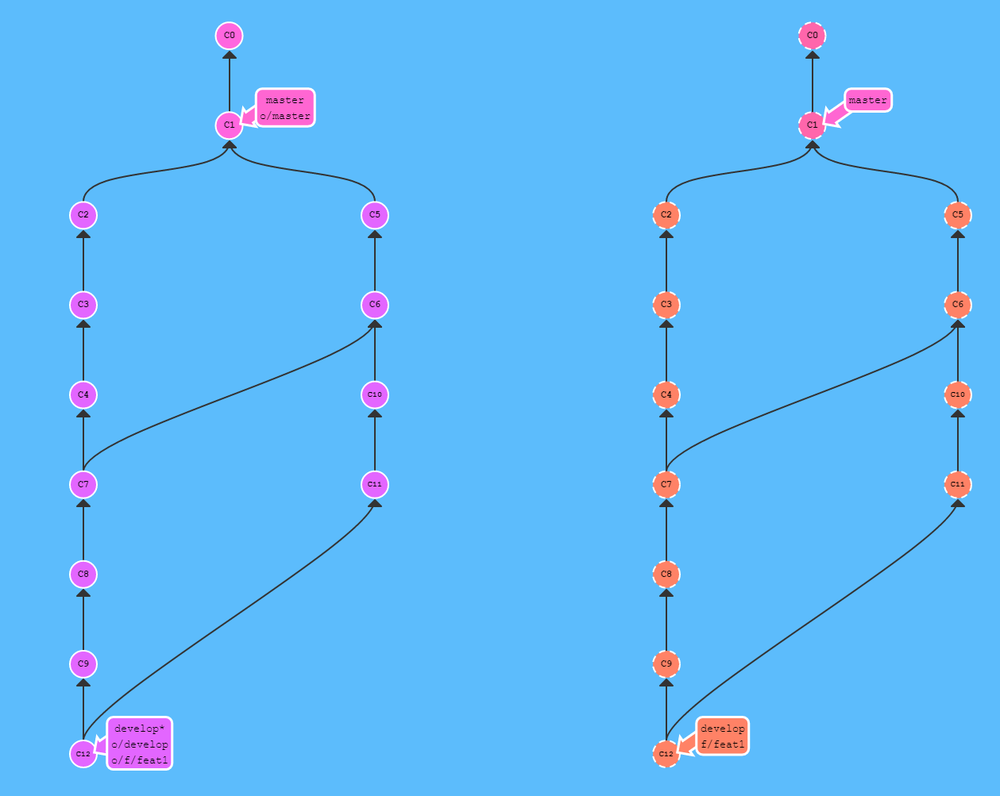
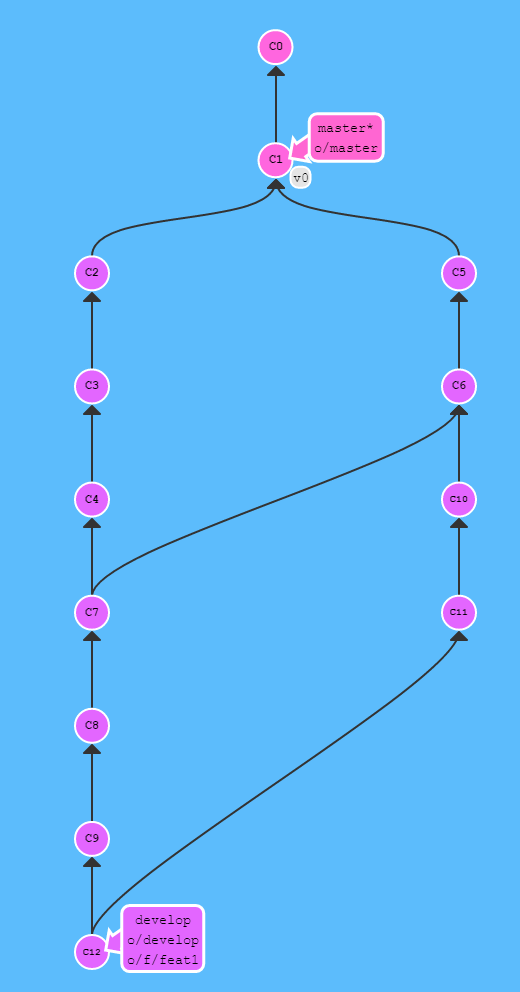
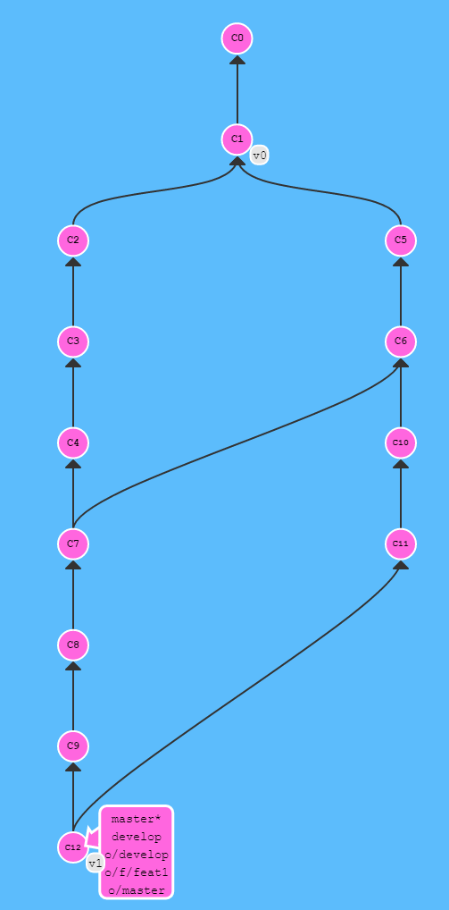

= Git workflow for ARGO Project
:toc:
:numbered:

== Install git

follow the instructions at https://doc.b-com.com/share/page/site/forge/wiki-page?title=Installer_GIT

== useful links

see. https://forge.b-com.com/file/download.php/129/295/p30_r113/bcom-Git-branching-model.pdf
for git bcom branching model

== git configuration

in ~/.gitconfig, add the following lines:

 [branch "master"]
    mergeoptions = --no-ff

this will configure merge command in "no fast forward" mode ()

image::task-7725-git-user-guide\task-7725-git-user-guide-90e9a.png[]

in ~/.gitconfig; add the following lines:

 [alias]
    lg1 = log --graph --abbrev-commit --decorate --format=format:'%C(bold blue)%h%C(reset) - %C(bold green)(%ar)%C(reset) %C(white)%s%C(reset) %C(dim white)- an%C(reset)%C(bold yellow)%d%C(reset)' --all
    lg2 = log --graph --abbrev-commit --decorate --format=format:'%C(bold blue)%h%C(reset) - %C(bold cyan)%aD%C(reset) %C(bold green)(%ar)%C(reset)%C(bold yelow)%d%C(reset)%n''          %C(white)%s%C(reset) %C(dim white)- %an%C(reset)' --all
    lg = !"git lg1"

this will provide useful aliases in command line, in order to display the log tree.
Typically, you may use:

  $ git lg2

to display the commits tree in a console.

== git workflow

Pre-requisite: a git repository has been created under the forge.
The workflow can be tested using the following git repository:
 ssh://gitolite@forge.b-com.com/atadrist-sandbox/test/git1.git

=== clone the git repository
* go to a working directory where you want to manage the git working copy
* git clone ssh://gitolite@forge.b-com.com/atadrist-sandbox/test/git1.git
* A new folder will be created ("git1" for example )
* cd git1

image::task-7725-git-user-guide\task-7725-git-user-guide-56fd1.png[]

=== creation of a develop branch
* "git branch" will display the list of existing branches
If the develop branch does not exist, follow the instructions:

* git checkout -b develop master
* git push origin develop
** create a develop branch from master
** push the develop branch on the remote repository

image::task-7725-git-user-guide\task-7725-git-user-guide-0e87d.png[]

=== a new feature will be managed by a dedicated branch: feature/feature1

image::task-7725-git-user-guide\task-7725-git-user-guide-af93f.png[]

* first, we have to update the develop branch
** git checkout develop, git pull origin develop
* git checkout -b feature/feature1 develop
** the feature/feature1 is created from the develop branch
* git commit ...
** some commits are done on the feature/feature1 branch

=== the feature branch is created on the repository
image::task-7725-git-user-guide\task-7725-git-user-guide-0d1b0.png[]
* git push origin feature/feature1
** pushes/creates the  feature/feature1 branch on the repository
* the feature branch may be pushed (typically everyday) on the repository, to backup modifications
*** see <<pushing the feature branch>>

=== pushing the feature branch
* before pushing the feature branch it may be a good idea to merge it with the latest develop branch
* because the develop branch may have evolved due to other developers' updates:

// image::task-7725-git-user-guide\task-7725-git-user-guide-fe3bd.png[]

* Pull the remote develop branch:
** git checkout develop
** git pull --ff-only origin develop

* Merge local feature branch with develop branch
** git checkout feature/feature1
** git merge --no-ff develop
*** conflicts may occur
*** they must be resolved file by file
*** when resolved, git add <filename> must be called to close the conflict

* when merge is done, we will be able to push the feature branch on the remote repository:
** git push origin feature/feature1

//image::task-7725-git-user-guide\task-7725-git-user-guide-4e539.png[]

Those steps can be performed periodically (for instance every day) in order to backup the feature branch on the remote repository. Moreover this process eases conflicts resolution between develop and feature branches.

The history tree will look like this after two pushes:

== pull-request
* a pull request will occur when we are ready to merge the feature branch with develop branch on the remote repository
* a clean pushed feature branch is a pre-requisite to this operation, see <<pushing the feature branch>>
** pull request is performed through a forge form (click on "submit a pull request")
** source : feature/feature1
** destination : develop
* After validation of pull-request, a git pull origin develop may be done:

//image::task-7725-git-user-guide\task-7725-git-user-guide-62ea6.png[]

== deleting feature branches
* local feature branches can be deleted
** note that it is not allowed to delete a remote branch
** git branch -d feature/feature1
* resulting in the following tree:

//image::task-7725-git-user-guide\task-7725-git-user-guide-f2c96.png[]

== managing the master branch
we will manage the master branch the following way:

* management of versions
** git checkout master
** git tag v0  for initial version
** git push origin master --tags

* after insertion of a feature branch into develop branch, an administrator will locally merge the develop branch with the master branch:
** git checkout master
** git merge --no-ff develop
** git tag v1 (for instance)
** git push origin master --tags

== Branching model
Argo will respect the following branches model:

* a master branch
* a develop branch
* "features" branches
