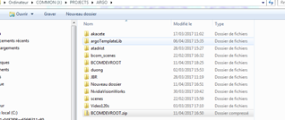
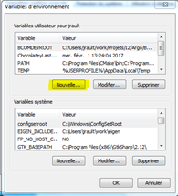
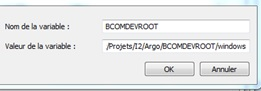
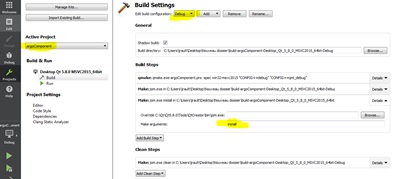
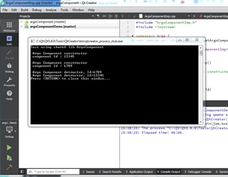

How to build a Argo component :

1.  Download BCOMDEVROOT.zip from J:\PROJECTS\ARGO

1.  Extract the content somewhere in your PC, e.g.
C:\Users\username\work\Projets\I2\Argo\BCOMDEVROOT
2.  Open the System propriety panel

image:media/image2.png[image,width=151,height=175]

1.  Click on “variables d’environnement”
2.  Add a new variable called BCOMDEVROOT with the key equal to the
location of BCOMDEVROOT data, see 2)

1.  Save and close the panel
2.  Git Clone the two following repositories in your working directory
anywhere you like:
a.  http://forge.b-com.com/git/argo/F-Argo/packages/ArgoComponent.git[_http://forge.b-com.com/git/argo/F-Argo/packages/ArgoComponent.git_]
b.  http://forge.b-com.com/git/argo/F-Argo/packages/ArgoComponentDemo.git[_http://forge.b-com.com/git/argo/F-Argo/packages/ArgoComponentDemo.git_]
3.  Open the two corresponding pro files with Qt creator. This gives you
something like

image:media/image5.png[image,width=158,height=62]

1.  Important: click on ‘Projects’ on the left panel and for
argoComponent (as active project) add a make build step with ‘install’
as argument. Do that for both debug and release configurations.

1.  Then click on Edit on the left panel and build first argoComponent
(right-click + Run qmake + Clean + Rebuild)
2.  Then select argoComponentDemo as the active project (right-click)
and build it the same way as above.
3.  Click on Run , you should get :

1.  Do the same procedure for the release configuration.
